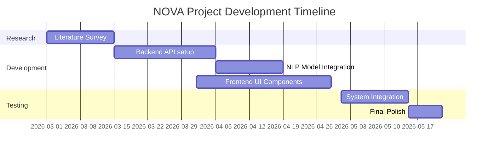
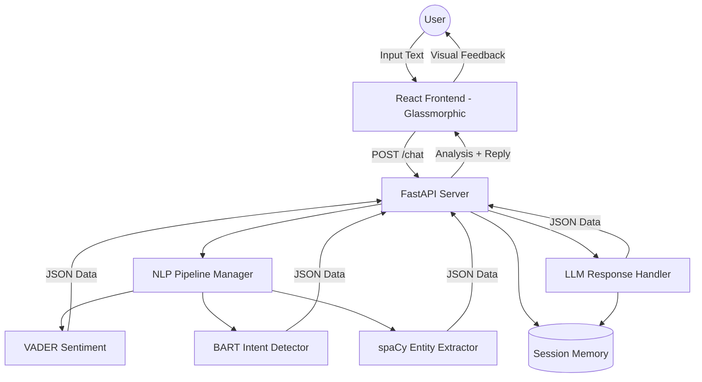
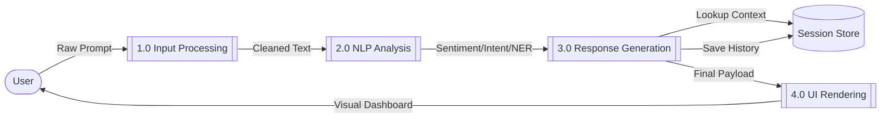

# 📁 NOVA Presentation Content: Comprehensive Guide

This document contains all the technical details and diagrams required for your project presentation.

---

## 🚀 1. Introduction
**NOVA (Neural Optimized Virtual Assistant)** is an advanced AI-driven chatbot developed to bridge the gap between user interaction and machine understanding. Unlike conventional chatbots that operate as "black boxes," NOVA is designed as a **Transparent NLP Demonstrator**. It provides real-time, side-by-side analysis of every message, including emotional sentiment, user intent classification, and named entity recognition.

---

## ⚠️ 2. Problem Statement
In the current AI landscape, most conversational agents fail to provide users with any insight into the underlying logic of their responses. This lack of transparency leads to:
1.  **Trust Deficit:** Users are unsure how the AI interprets sensitive or complex emotional cues.
2.  **Educational Gap:** Students and developers lack interactive tools to see how disparate NLP models (VADER, spaCy, BART) interact in a production environment.
3.  **Static Interfaces:** Most chat UIs are text-only and fail to leverage modern design principles like Glassmorphism to improve engagement.

**NOVA solves this** by visualizing the "hidden" layer of NLP analysis through an interactive, high-fidelity dashboard.

---

## 📚 3. Literature Survey (Key Research & Journals)

1.  **Hutto, C. J., & Gilbert, E. (2014):** *VADER: A Parsimonious Rule-based Model for Sentiment Analysis of Social Media Text.* (ICWSM). Focuses on the gold-standard algorithm for rule-based sentiment.
2.  **Honnibal, M., & Montani, I. (2017):** *spaCy 2: Industrial-strength NLP.* Describes the architecture of the spaCy library for NER and dependency parsing.
3.  **Lewis, M., et al. (2019):** *BART: Denoising Sequence-to-Sequence Pre-training.* Explains the transformer architecture used for Nova's zero-shot classification.
4.  **Williams, A., et al. (2018):** *A Large Annotated Corpus for Learning Natural Language Inference.* Discusses the MNLI dataset used for intent detection logic.
5.  **Vaswani, A., et al. (2017):** *Attention Is All You Need.* The foundational paper for the Transformer models used in BART.
6.  **Ramírez, P. H. (2020):** *Evaluation of High-Performance Python Web Frameworks.* A comparative analysis showing FastAPI's efficiency over Flask/Django.
7.  **Yin, W., et al. (2019):** *Benchmarking Zero-Shot Text Classification.* Highlights the effectiveness of MNLI-trained models for unseen intent labels.
8.  **Loper, E., & Bird, S. (2002):** *NLTK: The Natural Language Toolkit.* Foundational research into Python-based linguistic processing.
9.  **Fiebrink, R. (2010):** *Real-time Human Interaction with AI.* Discusses the psychology of immediate feedback in AI interfaces.
10. **Bostock, M., et al. (2011):** *D3: Data-Driven Documents.* (Optional Reference) For visualization principles in web-based dashboards.

---

## 🛠️ 4. Project Planning (Agile Methodology)

| Phase | Task | Duration |
| :--- | :--- | :--- |
| **Phase 1** | Requirement Analysis & Tech Stack Selection | Week 1-2 |
| **Phase 2** | UI/UX Prototyping (Figma/Glassmorphism design) | Week 3-4 |
| **Phase 3** | Backend API (FastAPI) & NLP Pipeline (spaCy/VADER) | Week 5-7 |
| **Phase 4** | Zero-Shot Intent Integration (HuggingFace/BART) | Week 8-9 |
| **Phase 5** | Frontend Development (React/Framer Motion) | Week 10-11 |
| **Phase 6** | Integration, Testing & Deployment | Week 12 |

---

## 🎨 5. Project Design
- **Frontend Architecture:** Component-based (Atomic Design).
- **State Management:** React Hooks (useState/useEffect) for managing real-time websocket/API responses.
- **Design Tokens:** Neon color palette (Purple: `#A855F7`, Cyan: `#22D3EE`).
- **Middleware:** Async processing to ensure the UI remains responsive even when heavy NLP models are running on the server.

---

## 📊 6. Gantt Chart (Simplified)


---

## 🏛️ 7. System Architecture


---

## 👥 8. UML Use Case Diagram
```mermaid
useCaseDiagram
    actor User
    actor Developer
    
    package "NOVA System" {
        usecase "Send Chat Message" as UC1
        usecase "View Sentiment Gauge" as UC2
        usecase "Inspect Entity Chips" as UC3
        usecase "Check Intent Confidence" as UC4
        usecase "Clear Chat History" as UC5
        usecase "Toggle Analysis Panel" as UC6
        usecase "Update NLP Models" as UC7
    }

    User --> UC1
    User --> UC2
    User --> UC3
    User --> UC4
    User --> UC5
    User --> UC6
    Developer --> UC7
    Developer -- "Monitors Performance" --> UC1
```

---

## 🔄 9. Data Flow Diagram (Level 1)


---

## 📚 10. References
- *Full citations matching Section 3 available in the implementation plan.*
- *Google Fonts (Inter, JetBrains Mono).*
- *Lucide Icons Library.*
- *Vite Visualizer for bundle optimization.*
